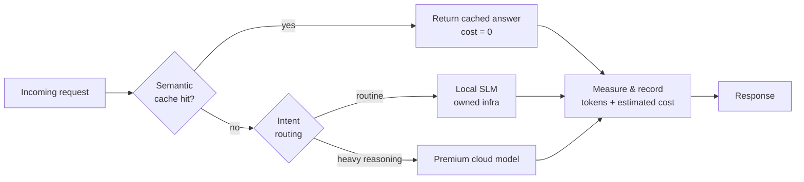
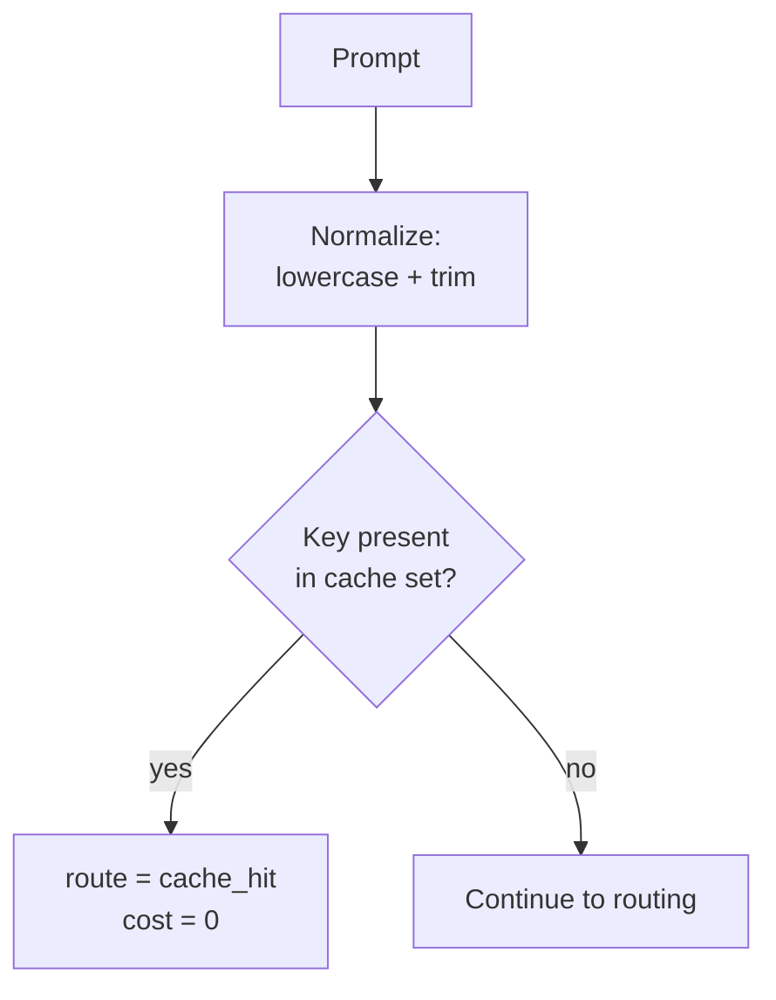
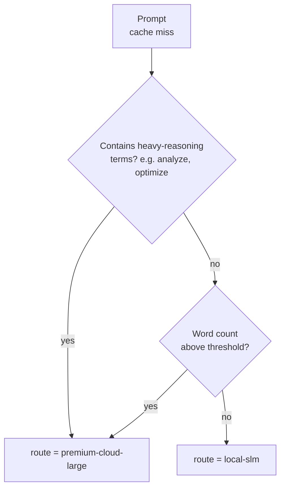
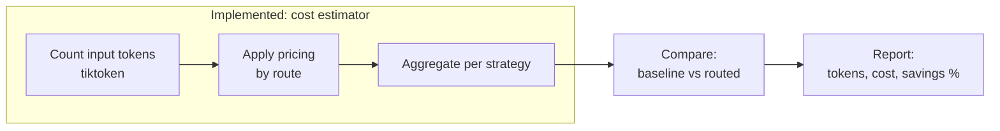

# Architecture — AI Pod Request Lifecycle

This document describes the reference architecture for LLM request routing in an LLM-backed workflow, of the kind a Folder IT AI Pod builds. It is a **blueprint**: it documents the full conceptual lifecycle, while only the cost-estimation slice is implemented as code in this repository. Each section states clearly what is implemented and what is documented-only.

---

## Overview

The blueprint models every incoming request through four stages: **cache → route → execute → measure**. The goal is to avoid paying premium inference cost for work that does not need it, and to make the cost of every request visible.

**Implemented in this repo:** the cost model behind every branch (what each path would cost), plus the exact-match cache and the routing rules.
**Documented-only (conceptual):** the actual semantic cache lookup, the real SLM inference, and the real premium API call. This repository does not call any model.

---

## Stage 1 — Cache check

**Purpose:** return a stored answer for a repeated request at zero token cost.

In the reference, the cache is an **exact-match** lookup over a normalized prompt (lowercased, trimmed). This keeps the reference deterministic and offline. A real deployment would replace this with a semantic cache — embeddings plus a vector-distance threshold — so that near-identical phrasings also hit. That upgrade is intentionally out of scope for v0.1 (see ADR-001).

---

## Stage 2 — Intent routing

**Purpose:** send routine requests to a cheap or zero-cost target, and reserve premium models for requests that genuinely need heavier reasoning.

Routing in the reference is **rule-based and transparent**, not a trained classifier (see ADR-002). The rules are applied in order and each decision carries the reason that produced it, so it is fully testable.

The term list and the word-count threshold are configuration, not magic constants. A real deployment tunes them per workload.

---

## Stage 3 — Execution

**Purpose:** the selected target handles the request.

This stage is **documented-only**. In a real deployment the local SLM (for example, a self-hosted open model) or the premium cloud model would generate the answer. The reference does not perform inference; it only reasons about which target would be used and what that would cost.

---

## Stage 4 — Measurement

**Purpose:** record token consumption and estimated cost for every request, regardless of route.

Measurement is what makes FinOps possible: you cannot control a cost you do not record. The estimator counts input tokens deterministically with `tiktoken`, applies a dated pricing table, and aggregates cost across the dataset. Output tokens are a declared per-request estimate, since no model is called (see ADR-003 and ADR-004).

---

## Component map

Which parts are code, and which are blueprint:

| Component | Status | Notes |
|-----------|--------|-------|
| Cost estimator | **Implemented** | `src/cost_estimator/`, deterministic, offline |
| Exact-match cache | **Implemented** | Reference stand-in for a semantic cache |
| Rule-based router | **Implemented** | Transparent rules, fully tested |
| Pricing table | **Implemented** | Dated, sourced in `docs/decision_records/sources.md` |
| Semantic cache (embeddings) | Conceptual | Candidate for a v0.2 module |
| Local SLM inference | Conceptual | Runs on owned infrastructure in a real deployment |
| Premium model call | Conceptual | External API in a real deployment |
| Latency measurement | Out of scope | Cannot be measured honestly offline |

---

## Design decisions (ADRs)

Short records of why the reference is built the way it is. Each one favors honesty and reproducibility over apparent sophistication.

### ADR-001 — Exact-match cache instead of a semantic cache
**Decision:** the reference uses an exact-match cache over normalized prompts.
**Why:** it stays deterministic and needs no model download or network call, so tests and the benchmark always reproduce. A semantic cache is the natural v0.2 but would add embeddings and a vector store, trading reproducibility for realism. Kept out of v0.1 on purpose.

### ADR-002 — Rule-based routing instead of a trained classifier
**Decision:** routing is a short, ordered set of explicit rules.
**Why:** the point of the reference is to show the routing *decision* transparently, not to ship a good classifier. Rules are readable, testable, and carry an explicit reason per decision. A learned router is a real-deployment concern, not a blueprint concern.

### ADR-003 — Model cost, not latency
**Decision:** the reference estimates cost and does not report latency.
**Why:** latency can only be measured against real inference. Reporting fabricated or mock timings (as an earlier draft did with wall-clock timers around mock operations) would be misleading. Cost, by contrast, can be modeled honestly and reproducibly offline.

### ADR-004 — Local SLM modeled at zero token cost, with an opt-in infra cost
**Decision:** local inference is priced at zero tokens by default; the estimator accepts an optional per-request infrastructure cost.
**Why:** owned infrastructure has no per-token bill, but it is not truly free. Defaulting to zero keeps the baseline comparison simple; the opt-in parameter lets you model real compute cost instead of pretending it away. The simplification is documented in `docs/decision_records/assumptions.md`.

### ADR-005 — Dated, sourced pricing
**Decision:** the pricing table carries a date and every price cites its source.
**Why:** provider prices change. A dated snapshot makes results reproducible and lets a reader re-run the benchmark against current prices. Sources live in `docs/decision_records/sources.md`.

---

## How to extend this blueprint

If a team wants to move from reference to something closer to production, the honest next steps, in order:

1. Replace the exact-match cache with a real semantic cache (embeddings + cosine similarity) as a separate module.
2. Add real inference adapters behind the routing decision, guarded so tests still run offline.
3. Introduce measured latency once real calls exist, alongside the existing cost model.

Each step is additive and keeps the reference honest: nothing is claimed until it is actually implemented.
